# Vault Storage

<p align="center">
  
</p>

A modern file storage and management application built with Vue.js, Hono, Cloudflare Workers, Cloudflare R2, and Cosmos DB.

## Status

🚧 **Under Active Development**

This project is currently in active development. Core features are functional but some features are still being implemented. See [docs/roadmap.md](docs/roadmap.md) for detailed project status and roadmap.

## Features

**Implemented:**
- **Secure File Storage**: Upload, organize, and manage your files
- **Authentication**: Secure access with email/password login, passwordless magic links, and password recovery
- **Cloud-Native Infrastructure**: Built on Cloudflare Workers and Azure for reliable, scalable storage
- **Modern User Experience**: Clean, intuitive interface with dark/light theme support
- **Type-Safe Architecture**: Robust API contracts ensuring data integrity


## Tech Stack

- **Frontend**: Vue 3, Pinia, Tailwind CSS, Vue Router
- **Backend**: Hono (Node.js), TypeScript
- **Storage**: Cloudflare R2, Azure Cosmos DB
- **Authentication**: Argon2id password hashing, JWT tokens, magic links
- **Email**: Resend API (production), in-memory capture (dev/tests)
- **Testing**: Vitest (unit + integration tests)
- **SDK**: Shared TypeScript/Zod schemas for API contracts

## Project Structure

```
vault-storage/
├── apps/
│   ├── web/          # Vue.js frontend (vertical slice modules)
│   └── server/       # Hono backend API
├── packages/sdk/     # Shared Zod schemas + VaultClient
└── docs/             # ADRs and roadmap
```

## Getting Started

For local development setup and instructions, see [CONTRIBUTING.md](CONTRIBUTING.md).

## Self-Hosting

See [docs/deploy.md](docs/deploy.md) for the full production deployment guide. Covers provisioning infrastructure (Azure + Cloudflare), setting up Infisical for secret management, and configuring GitHub Actions CI/CD.

## Documentation

- [Deployment Guide](docs/deploy.md) — production setup and CI/CD
- [Architecture Decisions (ADRs)](docs/adr/) - Design rationale and technical decisions
- [Roadmap](docs/roadmap.md) - Project status and roadmap
- [Domain Documentation](docs/agents/domain.md) - Multi-context architecture

## License

MIT License - see [LICENSE](LICENSE) file for details.

## Contributing

See [CONTRIBUTING.md](CONTRIBUTING.md) for guidelines on contributing to this project.
