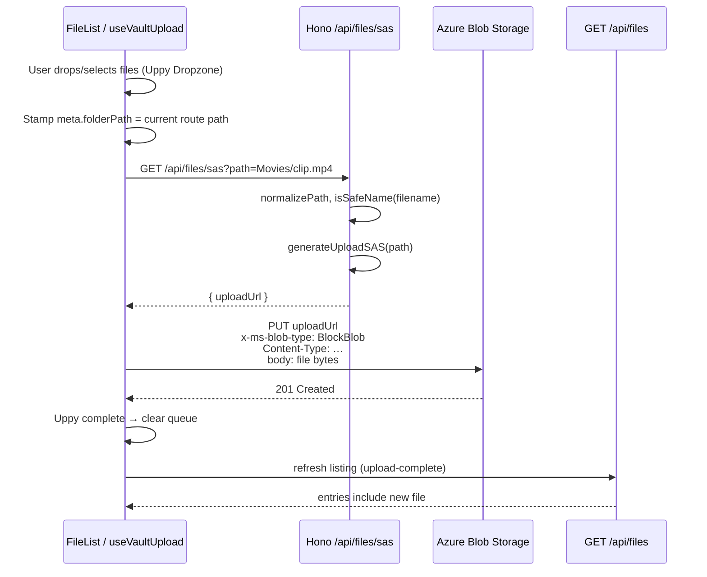

# ADR 0006: Browser upload via short-lived blob SAS (Uppy + direct PUT)

**Status:** Accepted  
**Date:** 2026-05-18

## Context

Vault needs a way for users to add files from the browser into Azure Blob
Storage. Blobs are addressed by path inside a single container (see
[ADR 0003](0003-path-as-identifier.md)). The server already implements
full blob CRUD through `AzureBlobStore` and exposes listing, download,
rename, and delete over HTTP.

The first upload implementation was `POST /api/files/upload`: the browser
sent `multipart/form-data` to the Hono server, which streamed bytes into
Azure via the SDK. That works and remains in the codebase, but it has
 drawbacks at scale:

- **Every byte crosses the app server.** Upload bandwidth and memory
  pressure land on the Node process, not on Azure's edge.
- **No natural upload progress in the browser** without custom streaming
  plumbing on both sides.
- **Harder to parallelise** large batches without building queue logic
  ourselves.

We want uploads that:

1. Keep the server out of the data path after authorisation.
2. Work against production Azure **and** Azurite without separate code
   paths ([ADR 0004](0004-azurite-for-local-dev.md)).
3. Respect path-as-identifier rules: target blob name is derived from
   current folder + filename.
4. Integrate with a polished browser UX (drag-and-drop, queue, progress,
   retries) without reinventing a file uploader.

There is **no authentication layer yet** (gap #2). SAS issuance is
therefore unauthenticated today; this ADR documents that explicitly and
lists the hardening steps required when auth lands.

## Options considered

### A. Server-proxied multipart upload (`POST /api/files/upload`) — status quo

Browser → Hono → `AzureBlobStore.upload`.

**Pros**

- Simple mental model; one origin, no CORS on storage.
- Server enforces `MAX_UPLOAD_MB`, `isSafeName`, and can log every upload.
- Already implemented and covered by integration tests.

**Cons**

- Server is a bandwidth bottleneck.
- No first-class client progress without extra work.
- Poor fit for multi-GB files even with streaming.

**Disposition:** **Retained** for scripts, integration tests, and
seed tooling. **Not** the primary browser path.

### B. Server-proxied streaming with tus

Run [tus](https://tus.io/) (or tus-compatible middleware) on Hono; browser
uses `@uppy/tus`.

**Pros**

- Resumable uploads; server still controls auth and validation.
- Mature Uppy plugin.

**Cons**

- Still proxies all bytes through the app server.
- Requires a persistent tus store and more server surface area.
- Overkill until we need resume-after-network-drop for huge files.

**Rejected** for now.

### C. Direct-to-Azure via user-delegation SAS (browser PUT)

Browser asks the API for a **short-lived, blob-scoped** Shared Access
Signature (SAS), then `PUT`s the file body directly to
`https://{account}.blob.core.windows.net/{container}/{blob}?{sas}`.

**Pros**

- Zero upload bytes through Hono after SAS minting.
- Azure handles scale, TLS, and storage throughput.
- Works with Uppy `@uppy/xhr-upload` using `method: 'PUT'` and Azure's
  block-blob headers.
- SAS URL built from `container.getBlockBlobClient(path).url` inherits
  the correct endpoint from the connection string (production **or**
  Azurite `BlobEndpoint`).

**Cons**

- Requires **CORS rules** on the storage account allowing the web origin,
  `PUT`, and headers (`x-ms-blob-type`, `Content-Type`, etc.).
- Account **name + key** (or a SAS-signing identity) must be available to
  mint SAS tokens — connection string alone is insufficient unless parsed.
- SAS cannot enforce max file size; client and future auth layer must.
- Single-shot `Put Blob` is limited (~256 MB per Azure docs); larger files
  need block/chunk upload and a different SAS shape.
- Unauthenticated SAS endpoint is abusable if exposed publicly.

**Accepted** as the **primary browser upload path**.

### D. Direct-to-Azure via `@uppy/aws-s3` / custom signed-URL plugin

Same as C but using Uppy's S3-oriented plugin with Azure-compatible
signing.

**Rejected** — Azure blob SAS is not S3 SigV4. A dedicated flow (C) is
clearer than adapting the S3 plugin.

## Decision

**Use Option C: mint per-blob upload SAS on the server; upload from the
browser with Uppy (`@uppy/core` + `@uppy/xhr-upload` + `@uppy/vue`
headless components).**

Keep Option A (`POST /api/files/upload`) for non-browser callers and tests.

### End-to-end flow



### Blob path resolution

Upload target path follows the same rules as server-side upload:

| User location (route) | File name | Blob path (`path` query / SAS blobName) |
|-----------------------|-----------|-------------------------------------------|
| `/files` (root)       | `note.txt`| `note.txt`                                |
| `/files/Movies`       | `clip.mp4`| `Movies/clip.mp4`                         |
| `/files/Movies/Action`| `a.mkv`   | `Movies/Action/a.mkv`                     |

Frontend (`useVaultUpload.ts`):

```ts
function blobPath(folderPath: string, fileName: string): string {
  const prefix = folderPath ? `${folderPath.replace(/\/+$/, "")}/` : ""
  return `${prefix}${fileName.replace(/^\/+/, "")}`
}
```

Server normalises with `normalizePath()` before SAS generation
(`apps/server/src/lib/paths.ts`).

### API: `GET /api/files/sas`

**Request**

```
GET /api/files/sas?path=Movies/clip.mp4
```

| Query param | Required | Description |
|-------------|----------|-------------|
| `path`      | yes      | Full blob name (normalised `a/b/file.ext`) |

**Success — `200`**

```json
{ "uploadUrl": "https://…/vault/Movies/clip.mp4?sv=…&sig=…" }
```

**Errors**

| Status | Condition |
|--------|-----------|
| `400`  | Missing `path`, or final path segment fails `isSafeName` |
| `500`  | Azure credentials missing, SAS generation failure |

**Not in SDK yet** — the SAS endpoint is web-internal today (`fetch('/api/files/sas')`).
When the SDK grows a browser upload helper, add a Zod schema in
`@vault/sdk` per [ADR 0001](0001-sdk-as-shared-contract.md).

### SAS generation (`generateUploadSAS`)

Location: `apps/server/src/lib/azure.ts`

| Property | Value |
|----------|-------|
| Permissions | `create` + `write` on the **blob** (`BlobSASPermissions`) |
| Lifetime | 15 minutes default (`expiresMinutes` parameter) |
| Clock skew | `startsOn` = now − 1 minute |
| URL construction | `{blockBlobClient.url}?{sasQuery}` — **not** hand-built `*.blob.core.windows.net` |
| Credentials | `resolveAccountCredentials()` from `AZURE_STORAGE_ACCOUNT_NAME` + `AZURE_STORAGE_ACCOUNT_KEY`, **or** parsed from `AZURE_STORAGE_CONNECTION_STRING` |

Using the SDK blob URL ensures Azurite dev URLs
(`http://127.0.0.1:{port}/devstoreaccount1/...`) and custom `BlobEndpoint`
values work without a separate code path.

**Important:** `BlobServiceClient.fromConnectionString` is enough for
`getContainer()` and ordinary CRUD, but SAS signing always needs a
**shared key** (account key from env or connection string). Connection-
string-only deployments must include `AccountName` and `AccountKey` in
the string (Azurite's well-known dev string does).

### Azure PUT contract (browser)

Uppy `@uppy/xhr-upload` configuration:

| Option | Value |
|--------|-------|
| `method` | `PUT` |
| `formData` | `false` (raw body) |
| `endpoint` | async function → fetches SAS URL per file |
| `headers` | `x-ms-blob-type: BlockBlob`, `Content-Type: file.type \|\| application/octet-stream` |
| `allowedMetaFields` | `[]` (no extra form fields) |
| `limit` | 3 parallel uploads |

Azure block blob single PUT requirements are satisfied by
`x-ms-blob-type: BlockBlob` on a full-body PUT.

### Frontend architecture

| Piece | Role |
|-------|------|
| `useVaultUpload.ts` | Owns one `Uppy` instance per `FileList`; wires XHRUpload + SAS |
| `FileList.vue` | Vault-themed list/grid for **browsing**; Uppy only for **upload** UX |
| `@uppy/vue` | `UppyContextProvider`, `Dropzone`, `FilesList` (queue), `UploadButton` |
| `FilesView.vue` | `@upload-complete` → `useFiles().refresh()` |

**UX layout**

- **Empty folder:** centred empty state + themed `Dropzone` + `UploadButton`.
- **Non-empty folder:** sticky footer with compact `Dropzone`; queue panel
  appears above the file list when files are staged.
- **Browsing** (sort, icons, selection highlight) stays native Vue — not
  Uppy's generic file rows — so the vault design tokens are preserved.

**Uppy restrictions (client)**

| Restriction | Source |
|-------------|--------|
| `maxNumberOfFiles: 20` | hard-coded in `useVaultUpload` |
| `maxFileSize` | `VITE_MAX_UPLOAD_MB` (default 100) × 1024² |

Server-side `POST /api/files/upload` enforces `MAX_UPLOAD_MB` from env;
the SAS path does **not** yet enforce size server-side.

**Lifecycle rules**

- On `file-added`: set `meta.folderPath` to the current route folder.
- On folder navigation: **clear** the pending upload queue (avoid uploading
  to the wrong prefix).
- On `complete`: remove successful files from Uppy, emit `upload-complete`.

### CORS (storage account)

The browser talks to two origins:

1. **App origin** — e.g. `http://localhost:3000` (Vite dev; proxied `/api`).
2. **Blob origin** — e.g. `https://{account}.blob.core.windows.net` or
   Azurite `http://127.0.0.1:10000`.

CORS must be configured on the **storage account** (Azure Portal → Storage
account → Settings → Resource sharing (CORS)):

| Setting | Dev value (example) |
|---------|---------------------|
| Allowed origins | `http://localhost:3000` |
| Allowed methods | `PUT`, `GET`, `HEAD`, `OPTIONS` (minimum: `PUT`) |
| Allowed headers | `*` or explicit: `content-type`, `x-ms-blob-type`, `x-ms-*` |
| Exposed headers | `*` (or as needed) |
| Max age | e.g. `3600` |

Without this, SAS URLs are valid but the browser blocks the cross-origin PUT.

`ALLOWED_ORIGIN` in `.env` controls Hono CORS for `/api/*` only; it does
**not** configure Azure storage CORS.

### Security model (current and future)

**Today (no auth)**

- Anyone who can reach the API can request a SAS for any path that passes
  `isSafeName` on the filename segment.
- SAS is scoped to a **single blob**, write/create only, ~15 minutes.
- Overwriting an existing blob is possible if the same path is uploaded
  again (Azure PUT semantics).

**When auth lands (gap #2) — required hardening**

1. Require authenticated session to call `GET /api/files/sas`.
2. Authorise `path` against the user's namespace (prefix / ACL).
3. Consider **user delegation SAS** or stored access policies instead of
   account-key signing in production.
4. Rate-limit SAS minting per user.
5. Optionally reject SAS requests for paths that already exist if overwrite
   should be explicit.

**Filename validation (`isSafeName`)**

Applied on SAS route to the **final segment** of `path`:

- Non-empty, ≤ 255 chars
- No `/`, `\`, control characters
- Not `.` or `..`

Full path normalisation strips leading/trailing slashes and `\` → `/`.

### Coexistence: `POST /api/files/upload`

Still used by:

- `tests/integration/files.test.ts` helper `uploadText()`
- Seed scripts / manual API testing
- Any client that prefers single-origin multipart

Both paths write the same blob names and appear identically in
`GET /api/files`. Prefer SAS for browser UI; prefer multipart for
automation unless/until SAS is added to the SDK client.

## Configuration

| Variable | Side | Purpose |
|----------|------|---------|
| `AZURE_STORAGE_CONNECTION_STRING` | server | Blob client + SAS key parsing |
| `AZURE_STORAGE_ACCOUNT_NAME` | server | Alternative to connection string |
| `AZURE_STORAGE_ACCOUNT_KEY` | server | SAS signing (required for SAS) |
| `AZURE_STORAGE_CONTAINER_NAME` | server | Container (default `vault`) |
| `MAX_UPLOAD_MB` | server | Multipart upload limit (default 100) |
| `VITE_MAX_UPLOAD_MB` | web | Uppy client size limit (default 100) |
| `ALLOWED_ORIGIN` | server | Hono CORS for API (not blob CORS) |

## Testing

Integration tests in `tests/integration/files.test.ts`:

| Test | What it proves |
|------|----------------|
| `GET /api/files/sas` returns URL with `sig=` | SAS minting against Azurite |
| `GET /api/files/sas?path=..` → 400 | Validation |
| Direct `fetch(PUT)` to `uploadUrl` then list | Full browser-equivalent path against Azurite |

Azurite is booted in-memory per [ADR 0005](0005-testing-strategy.md);
`generateUploadSAS` uses the SDK blob URL so tests hit the emulator endpoint,
not production hostnames.

## Known limitations

| Limitation | Notes |
|------------|-------|
| **~256 MB single PUT** | Azure block blob limit for one Put Blob. Larger files need staged block upload + different SAS permissions (`write` + block list APIs). |
| **No resume** | Failed PUT must retry from scratch unless we adopt block/chunk upload. |
| **No overwrite policy** | PUT replaces blob if path exists; no conflict UI. |
| **Client-only size cap on SAS path** | Malicious client can ignore `maxFileSize`. Server does not pre-validate size for SAS. |
| **SAS not in SDK** | Web uses raw `fetch`; contract duplication until SDK schema exists. |
| **No virus scan / content inspection** | Bytes never touch the app server on SAS path. |

## Triggers for revisiting

- **Files regularly &gt; 256 MB** → implement block blob staged upload
  (Uppy multipart or custom) and widen SAS permissions accordingly.
- **Auth shipped** → implement SAS authorisation and stop using account-key
  signing in production if policy requires.
- **Self-hosting without Azure** → SAS path may not apply; fall back to
  proxied upload ([ADR 0004](0004-azurite-for-local-dev.md) triggers).
- **Upload SDK in `@vault/sdk`** → add `getUploadUrl(path)` to
  `VaultClient` and delete raw `fetch` in the web app.

## Consequences

### Positive

- Upload traffic scales with Azure, not the Hono process.
- One implementation works for production Azure and Azurite.
- Uppy provides DnD, queue, parallel uploads (3-wide), and progress without
  custom UI code.
- Vault file browser keeps full themed list/grid; Uppy is scoped to upload.
- Integration tests cover SAS mint + direct PUT.

### Negative

- Operational requirement: storage account CORS must be configured per
  deployment environment.
- Account key (or equivalent signing material) must be available even when
  connection string drives the blob client.
- Two upload code paths to maintain until multipart is deprecated or SAS is
  unified in the SDK.

### Neutral

- `POST /api/files/upload` remains the canonical server-side upload for
  tests and tooling.
- Download path unchanged (`GET /api/files/download` still proxied through
  server).

## References

- [ADR 0001](0001-sdk-as-shared-contract.md) — wire contract / future SAS schema.
- [ADR 0003](0003-path-as-identifier.md) — blob path as identity.
- [ADR 0004](0004-azurite-for-local-dev.md) — local Azure emulation.
- [ADR 0005](0005-testing-strategy.md) — integration tests against Azurite.
- Implementation:
  - `apps/server/src/lib/azure.ts` — `generateUploadSAS`, `resolveAccountCredentials`
  - `apps/server/src/routes/files.ts` — `GET /sas`, `POST /upload`
  - `apps/server/src/lib/paths.ts` — `normalizePath`, `isSafeName`
  - `apps/web/src/composables/useVaultUpload.ts`
  - `apps/web/src/components/FileList.vue`
- [Uppy XHR Upload](https://uppy.io/docs/xhr-upload/) — dynamic `endpoint`, PUT.
- [Azure Put Blob (REST)](https://learn.microsoft.com/rest/api/storageservices/put-blob)
- [Azure CORS for storage](https://learn.microsoft.com/rest/api/storageservices/cross-origin-resource-sharing--cors--support-for-the-azure-storage-services)
